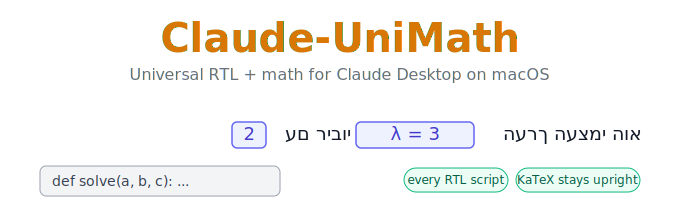

<div align="center">



# Claude-UniMath

**The first** RTL patch to bring proper **mathematics handling** to the Claude Desktop app on macOS.
Hebrew, Arabic, Persian, and every other right-to-left script — with LaTeX and KaTeX that stay upright and correct.

[](LICENSE)
[](#requirements)
[](#development--tests)
[](https://github.com/DavidiBellaire)

</div>

---

## The problem

Claude Desktop has **no right-to-left support at all**. If you work in Hebrew, Arabic, or Persian, every long conversation is a struggle — and the moment Claude writes mathematics, it falls apart completely. A rendered formula or an inline `$x^2$` dropped into RTL prose gets scattered by naive direction-flipping, and the line becomes unreadable.

Browser extensions solved this for **claude.ai** in the web browser. **Nobody solved it for the desktop app** — the [official Anthropic request](https://github.com/anthropics/claude-code/issues/38005) even notes that the Chrome extension *"works for web but not desktop,"* because injecting into Electron through the DevTools protocol fails. The desktop-only patches that do exist just flip whole lines and **leave math broken**.

**Claude-UniMath is the first to bring isolated-math RTL handling to the macOS desktop app.**

## See it

> Hebrew flows right-to-left, every formula stays an upright left-to-right island, code stays LTR.

<!-- 

-->
<div align="center">

<br><em></em>
</div>

## Why it is different

Every other RTL patch answers one question: *"is there an RTL character? then align the line right."* That breaks on mixed content. Claude-UniMath is built on a different idea — **isolation, not line-flipping**:

| | Other desktop patches | Browser extensions | **Claude-UniMath** |
|---|:---:|:---:|:---:|
| Works on the **macOS desktop app** | ✅ | ❌ | ✅ |
| **Math** isolated correctly in RTL text | ❌ | ✅ | ✅ |
| Rendered **KaTeX** *and* raw **LaTeX** | ❌ | partial | ✅ |
| **Currency-aware** (`$20` ≠ math) | ❌ | ❌ | ✅ |
| **Every** RTL Unicode script | partial | partial | ✅ |
| Live during **streaming** | ✅ | ✅ | ✅ |
| **Non-destructive** (original app untouched) | varies | n/a | ✅ |
| **Tested** (54 assertions) | ❌ | ❌ | ✅ |

<details>
<summary><b>The three ideas no one else implements on desktop</b> (click to expand)</summary>

<br>

- **Math isolation, not line flipping.** Each formula becomes a `unicode-bidi: isolate` left-to-right island. `הערך העצמי הוא $\lambda = 3$ עם ריבוי $2$` renders with the Hebrew flowing right and the formula upright and correct, exactly where it belongs.
- **Currency-aware LaTeX detection.** A bare `$` from a price (`$20`) is never mistaken for math — and, critically, it is never allowed to "steal" the closing delimiter of real math later on the same line. `שילמתי $20 עבור $x^2 + 1$` isolates only `$x^2 + 1$`.
- **Universal RTL coverage.** Not just Hebrew and Arabic — every right-to-left Unicode block, including Persian, Urdu, Syriac, Thaana, N'Ko, and astral-plane scripts like Adlam.

It also isolates **citation chips and inline UI atoms** so they sit on the correct side of an RTL line, handles content **live as it streams**, and is fully **idempotent** — re-processing never double-wraps or corrupts anything.

</details>

## Quick start

```bash
git clone https://github.com/DavidiBellaire/Claude-UniMath.git
cd Claude-UniMath
chmod +x install.sh        # only needed if you downloaded the ZIP
./install.sh --install
```

A patched copy is built at `~/Applications/Claude-UniMath.app` and launches automatically. **Your original `/Applications/Claude.app` is never touched.**

<details>
<summary><b>First launch: Gatekeeper & Keychain prompts (both expected)</b></summary>

<br>

- **Gatekeeper** — the copy is ad-hoc signed (not by Anthropic), so macOS may warn on first launch. Right-click the app → **Open**, or **System Settings → Privacy & Security → Open Anyway**.
- **Keychain** — macOS asks to allow access to "Claude Safe Storage". The copy has a different signature than the original, so macOS re-asks once. Safe to approve.

</details>

## Usage

```bash
./install.sh --install      # Install, or re-apply after a Claude update
./install.sh --uninstall    # Remove the patched copy
./install.sh --status       # Show install status and fuse state
./install.sh                # Interactive menu
```

Type or read any RTL language and it aligns automatically. Math stays upright and correct.

## Requirements

- **macOS** (tested on macOS 15 / macOS 26)
- **Claude Desktop** at `/Applications/Claude.app`
- **Node.js** v16+ ([nodejs.org](https://nodejs.org/) or `brew install node`) — provides `npx` for `@electron/asar` and `@electron/fuses`
- **Xcode Command Line Tools** (`xcode-select --install`) — provides `codesign`

<details>
<summary><b>How it works</b> (the patching pipeline)</summary>

<br>

The patcher is non-destructive — it **never modifies** the original app. Instead it:

1. Copies `Claude.app` → `~/Applications/Claude-UniMath.app`
2. Extracts the Electron `app.asar` archive
3. Prepends the Claude-UniMath payload to the renderer JavaScript
4. Repacks the archive
5. Disables the `EnableEmbeddedAsarIntegrityValidation` Electron fuse (required — Electron validates the archive hash at startup and would otherwise refuse to launch the modified copy)
6. Re-signs the copy with an ad-hoc signature, preserving the original entitlements

Because it builds a separate copy, no `sudo` is ever needed, your original Claude keeps auto-updating normally, and if anything goes wrong you just delete the copy.

**After a Claude update:** the auto-updater only touches the original. Re-run `./install.sh --install` to rebuild a fresh patched copy from the updated version.

</details>

## Development & tests

The engine is split so the logic is testable in isolation from Electron:

```bash
npm install        # installs jsdom (dev dependency) for the DOM tests
npm test           # full suite — 54 assertions, 0 failures
```

`src/core.js` is pure and DOM-free. `src/payload.js` inlines a synchronized copy for runtime injection; the suite verifies the inlined copy matches the module exactly, so they never drift.

```
Claude-UniMath/
├── install.sh          # macOS patcher (copy → inject → repack → sign)
├── assets/
│   └── banner.svg      # README banner
├── src/
│   ├── core.js         # Pure BiDi + math-detection engine (DOM-free, testable)
│   ├── dom.js          # DOM layer: isolates math & inline atoms, sets RTL direction
│   └── payload.js      # Self-contained IIFE injected into Claude Desktop
├── test/
│   ├── core.test.js    # RTL detection + math segmentation
│   └── dom.test.js     # isolation, streaming, idempotency, citation chips
├── package.json
├── LICENSE
└── README.md
```

## Troubleshooting

<details>
<summary><b>"Claude quit unexpectedly" on launch</b></summary>
<br>
The ASAR integrity fuse wasn't disabled. Re-run <code>./install.sh --install</code>. If it persists, confirm <code>npx</code> works: <code>npx --yes @electron/fuses --help</code>.
</details>

<details>
<summary><b>No RTL alignment</b></summary>
<br>
Make sure you're running <code>Claude-UniMath.app</code> from <code>~/Applications/</code>, not the original. Check Console.app for <code>[Claude-UniMath]</code> messages.
</details>

<details>
<summary><b><code>.vite/build/ not found</code></b></summary>
<br>
A Claude update changed the internal structure. This is the first place to look when a new version breaks the patch.
</details>

## A note on responsibility

This patch modifies Claude Desktop's internal files, which Anthropic does not officially support and which may be against their Terms of Service. It is provided as-is, for personal use, with no warranty. Use at your own discretion. The real fix is native RTL support in Claude — if you want that, add your voice to [the official request](https://github.com/anthropics/claude-code/issues/38005).

## License

[MIT](LICENSE) © 2026 Davidi Bellaire
